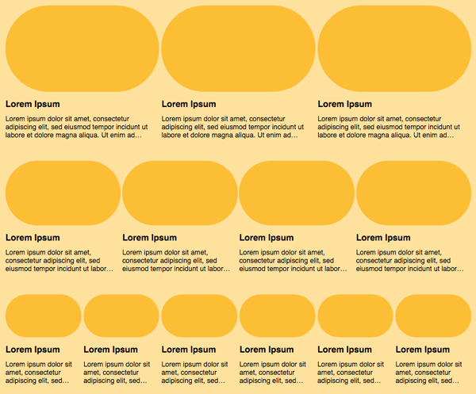

## Dynamic Layouts

Added an event Listener to change the Layout Dynamically. The Layouts can be configured in a props file.

<p align="center">
  
</p>

## FrontEnd

* React
* CRA (Boilerplate)
* Prop-types


## Main commands

```bash
# Install the dependencies
npm install

# Run website in dev (hot reload) mode ( http://localhost:3000 )
npm run start

# Run the tests
npm run test
